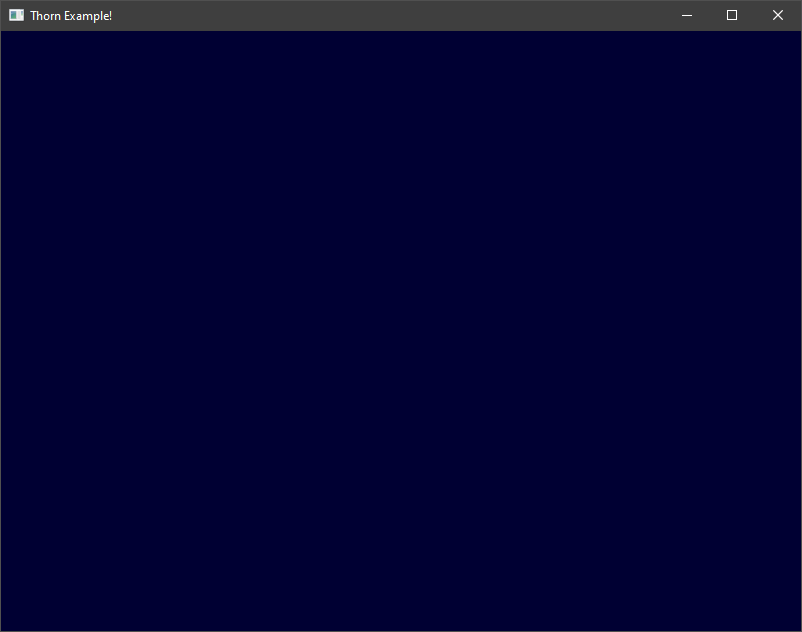

# Getting started: A blue window
This document will guide you through the process of opening a window and filling it with a dark-blue color.

#### Includes
```cpp
#include <thorn/context.hh>
#include <thorn/glad.hh>
#include <thorn/glfw/window.hh>
#include <iostream>
```
* `<thorn/context.hh>` contains a Thorn context definition.
* `<thorn/glad.hh>` contains a [GLAD](https://github.com/Dav1dde/glad) wrapper to load OpenGL and check its suitability.
* `<thorn/glfw/window.hh>` contains a [GLFWwindow](https://www.glfw.org/docs/latest/window_guide.html) wrapper.
* `<iostream>` contains standard input and output streams.

#### Context
```cpp
int main()
{
    // Create a new Thorn context.
    // Context is an abstraction that initializes
    // all the libraries that should be initialized.
    // This should be called only once in the begining
    // of an entry point of your application.
    THORN_INIT();

    // The code down below will be placed here
    // ...

    return 0;
}
```

#### Window
```cpp
// ...
// Open a new window
thorn::glfw::Window window(800, 600, "Thorn Example!");
// ...
```

#### OpenGL
```cpp
// ...
// Load OpenGL
window.makeContextCurrent();
if(!thorn::glad::load()) {
    std::cerr << "Failed to load OpenGL" << std::endl;
    return 1;
}
// ...
```

#### Vertical synchronization
```cpp
// ...
// VSync
window.setSwapInterval(1);
// ...
```

#### Main loop
``` cpp
// ...
// Main loop
while(!window.shouldClose()) {
    // ...
}
// ...
```

#### Escape = exit
```cpp
// ...
// Exit if ESC is pressed
if(window.isKeyJustPressed(GLFW_KEY_ESCAPE))
    window.setShouldClose(true);
// ...
```

#### Blue!
```cpp
// ...
// Clear the screen
glClearColor(0.0f, 0.0f, 0.15f, 1.0f);
glClear(GL_COLOR_BUFFER_BIT);
// ...
```

#### Frame's end
```cpp
// ...
// End frame
window.swapBuffers();
window.handleEvents();
// ...
```

#### Result


#### Full code
```cpp
#include <thorn/config.hh>
#include <thorn/context.hh>
#include <thorn/glad.hh>
#include <thorn/glfw/window.hh>
#include <iostream>

int main()
{
    // Create a new Thorn context.
    // Context is an abstraction that initializes
    // all the libraries that should be initialized.
    // This should be called only once in the begining
    // of an entry point of your application.
    THORN_INIT();

    // Open a new window
    thorn::glfw::Window window(800, 600, "Thorn Example!");

    // Load OpenGL
    window.makeContextCurrent();
    if(!thorn::glad::load()) {
        std::cerr << "Failed to load OpenGL" << std::endl;
        return 1;
    }

    // VSync
    window.setSwapInterval(1);

    // Main loop
    while(!window.shouldClose()) {
        // Exit if ESC is pressed
        if(window.isKeyJustPressed(GLFW_KEY_ESCAPE))
            window.setShouldClose(true);

        // Clear the screen
        glClearColor(0.0f, 0.0f, 0.15f, 1.0f);
        glClear(GL_COLOR_BUFFER_BIT);

        // End frame
        window.swapBuffers();
        window.handleEvents();
    }

    return 0;
}
```

#### Getting started
* [Requirements](00_requirements.md)
* [Cloning](01_cloning.md)
* [Building](02_building.md)
* **A blue Window**
